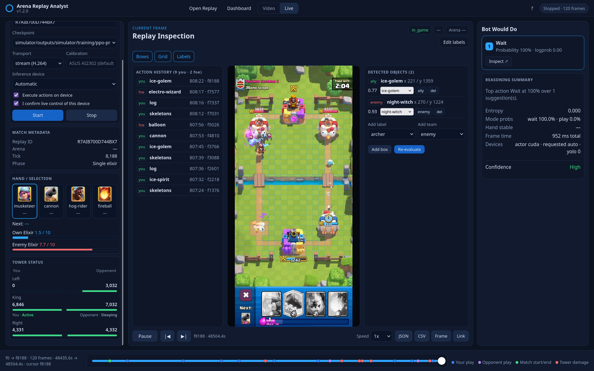
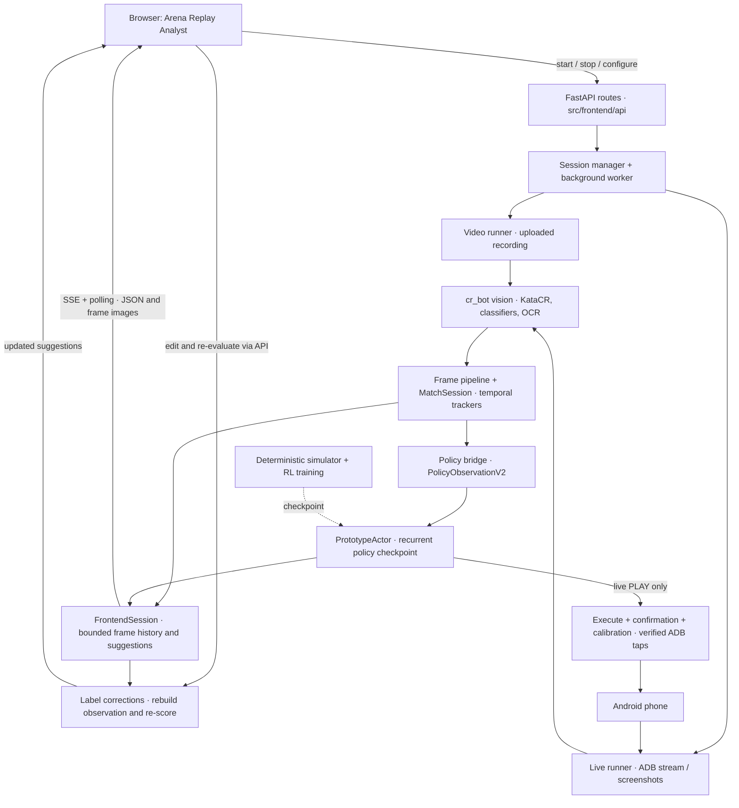

# Clash Royale RL Bot

This project runs a recurrent Clash Royale policy from live Android gameplay.
It captures the newest phone frame, extracts public game state with computer
vision, converts it to `PolicyObservationV2`, and lets the policy choose
`WAIT` or `PLAY(card_slot, (column, row))`.

The **Arena Replay Analyst** browser frontend brings recorded-video analysis,
live phone capture, and policy inspection into one workspace. Inspect detected
objects, cards, elixir, tower health, action history, and policy suggestions;
scrub the frame timeline, edit labels, and export results.



## Run the frontend

Complete the [development setup](#development), then run from the repository
root with the environment activated:

```bash
uvicorn src.frontend.server:app --reload
```

Open **http://127.0.0.1:8000/**. The UI is served by the Python backend and uses
native JavaScript modules; no Node.js installation or frontend build is needed.
The server loads vision and policy dependencies when analysis starts. Analysis
also needs the local detector/classifier assets and a policy checkpoint; the
checkpoint selector prefers `prototype.pt` in the repository root when present.

### Analyze a video

Select **Video** or **Open Replay**, upload a recording, and choose a checkpoint
and inference device. Set the start frame, frame stride, and frame limit as
needed. For recordings with a different layout, review and adjust the proposed
ROIs before starting analysis.

Use the timeline to inspect frames and confirmed own/opponent plays. Toggle
boxes, grid, and labels, inspect policy suggestions, or edit detections and
**Re-evaluate** the selected frame. Export frame data as JSON, action history as
CSV, or the current frame as an image. Recent replays retain the parameters for
rerunning analysis; they are not complete saved inference caches.

### Connect a live phone

Enable USB debugging, authorize the phone, and use `adb devices` to find its
serial. ADB must be available on the server; H.264 streaming also needs FFmpeg.
Select **Live**, enter the serial, and choose a checkpoint, transport
(H.264 stream or screenshot polling), and inference device (automatic, CPU, or
CUDA). Press **Start** to begin and **Stop** to end the session.

Leave **Execute actions on device** unchecked to observe and inspect policy
decisions. To enable taps, check it and **I confirm live control of this device**.
An empty Calibration field uses the repository's
[`ASUS AI2302 profile`](simulator/physical_lab/calibrations/phone-a-candidate.json)
for its 1080×2400 layout. For another device/layout, enter the path to its own
calibration JSON; relative paths resolve from the repository root.

See the [frontend guide](src/frontend/README.md) for keyboard shortcuts,
ROI editing, session behavior, and API endpoints.

## Run the packaged binary

For a standalone command-line workflow, the Linux executable documented in
[`simulator/RUN_PROTOTYPE_LIVE.md`](simulator/RUN_PROTOTYPE_LIVE.md) bundles the
Python runtime, CPU PyTorch, visual extractor, KataCR inference, default
checkpoint, card assets, ADB, and FFmpeg. It does not require a Python setup.

Download `prototype-live-linux-x86_64` from the
[latest GitHub release](https://github.com/keschler/cr-bot/releases/latest).

```text
phone → live stream → visual extractor → public state
      → policy → card + placement → ADB → phone action
```

> [!NOTE]
> The Linux x86-64 binary is approximately **800 MB** because it bundles the
> Python runtime, visual-extractor assets, policy, ADB, FFmpeg, and their
> dependencies. It uses **CPU inference only**, which is substantially slower
> than GPU inference. An RTX 2050 / Intel i9-13900H machine reached up to
> **4 FPS** during a live-action run. A GPU build is not distributed because
> its additional dependencies would make the download significantly larger.

### 1. Make it executable

```bash
chmod +x prototype-live-linux-x86_64
```

### 2. Test on a video

Use the current best trained policy,
[`prototype.pt`](https://github.com/Keschler/cr-bot/releases/download/v0.5/prototype.pt):

```bash
./prototype-live-linux-x86_64 \
  --checkpoint /absolute/path/to/prototype.pt \
  --video /absolute/path/to/gameplay.mp4 \
  --max-frames 20
```

`--checkpoint` is optional when the bundled `prototype-fast-current` policy is
sufficient.

The repository also includes a [1080×2400 sample gameplay video](assets/pictures/gameplay.mp4)
that can be used to reproduce the extractor locally. It starts with roughly
five seconds of loading and the versus animation, so sampling every tenth
source frame reaches the in-game section without preprocessing the video:

```bash
./prototype-live-linux-x86_64 \
  --checkpoint /absolute/path/to/prototype.pt \
  --video assets/pictures/gameplay.mp4 \
  --frame-stride 10 \
  --max-frames 30 \
  --jsonl-out /tmp/prototype-gameplay.jsonl
```

`--max-frames` counts processed frames; with `--frame-stride 10`, these 30
frames cover approximately the first 10 seconds. Use `--frame-stride 1` to
process every frame, allowing enough frames to pass the opening animation.
If you downloaded only the release binary, the same video is available as a
[direct download](https://github.com/Keschler/cr-bot/raw/main/assets/pictures/gameplay.mp4).

### 3. Dry run on a phone

Enable USB debugging, connect and authorize the phone, then use its exact ADB
serial:

```bash
./prototype-live-linux-x86_64 \
  --checkpoint /absolute/path/to/prototype.pt \
  --serial YOUR_PHONE_SERIAL \
  --max-frames 100 \
  --jsonl-out /tmp/prototype-live.jsonl
```

> [!NOTE]
> This is a dry run by default: it observes the game and records decisions,
> but never taps the phone. The default transport is a low-latency H.264
> stream; use `--adb-transport screenshot` for diagnosis.

### 4. Enable live actions

> [!WARNING]
> Live actions are calibrated only for a **1080×2400 phone**. Do not enable
> taps on another resolution or layout without a separately reviewed
> calibration.

Validate dry runs first. Real taps require a phone-specific calibration file
and both confirmation flags:

```bash
./prototype-live-linux-x86_64 \
  --checkpoint /absolute/path/to/prototype.pt \
  --serial YOUR_PHONE_SERIAL \
  --calibration /absolute/path/to/phone-calibration.json \
  --execute \
  --confirm-live
```

Before every `PLAY`, the controller verifies the selected card and applies the
calibrated card and arena taps. `WAIT` never taps the phone. Press `Ctrl-C` to
stop the controller.

## Development

Python 3.12 is required for source development because the pinned PyTorch and
JAX wheels do not support the newer system Python versions:

```bash
git clone https://github.com/Keschler/cr-bot.git
cd cr-bot
git submodule update --init vendor/external/KataCR
python3.12 -m venv outputs/venv
source outputs/venv/bin/activate
python -m pip install --upgrade pip
pip install -e .
```

Initialize KataCR at the pinned revision before starting analysis. The live
runtime can fall back to an older checkout under `capture/vendor`; that copy
may lack the tracker compatibility fixes in `vendor/external/KataCR`.

The source launcher accepts the same options as the packaged executable:

```bash
python simulator/run_prototype_live.py \
  --video /absolute/path/to/gameplay.mp4 \
  --max-frames 20
```

Run the default test suite with:

```bash
pytest --ignore=tests/test_audio_dataset.py --ignore=tests/test_mining_pipeline.py
```

See [`simulator/RUN_PROTOTYPE_LIVE.md`](simulator/RUN_PROTOTYPE_LIVE.md) for
complete ADB setup, option reference, troubleshooting, safety gates, and native
PyInstaller build instructions.

## Simulator and RL status

The policy is trained against a deterministic, versioned Level-11 simulator.
The actor receives public observations only; privileged simulator state is
restricted to the training critic. The RL stack includes recurrent factorized
PPO, deterministic curriculum states, held-out evaluation, checkpoint
regression diagnosis, and simulation-exploit auditing.

The V1 research ruleset contains 124 definitions and the complete 109-card
eligible opponent roster, but remains explicitly `training_ready: false` until
its physical-fidelity evidence gates are satisfied. Current checkpoint results
are simulator evidence, not proof of live-game strength.

Detailed simulator architecture, training commands, evaluation gates, and
performance notes are in [`simulator/README.md`](simulator/README.md).

## Repository layout

```text
cr-bot/
├── simulator/
│   ├── run_prototype_live.py       command-line live/video launcher
│   ├── RUN_PROTOTYPE_LIVE.md       distribution and live-operation guide
│   ├── prototype_live.spec         one-file PyInstaller build
│   ├── physical_lab/               phone control, calibration, and safety gates
│   ├── rl/                         policy, PPO, curriculum, and evaluation
│   ├── engine/                     deterministic battle engine
│   ├── rulesets/                   versioned card and mechanic definitions
│   ├── rosters/                    supported opponent roster data
│   ├── scenarios/                  deterministic simulator scenarios
│   └── tests/                      simulator-local tests
├── src/frontend/                  Arena Replay Analyst web application
│   ├── server.py                   Uvicorn entry point (app compatibility shim)
│   ├── app.py                      FastAPI factory, routers, and static serving
│   ├── api/                        session, frame, stream, ROI, and edit endpoints
│   ├── models/                     requests, analyzed frames, and session state
│   ├── services/                   workers, checkpoints, uploads, replay library
│   ├── runners/                    video/live orchestration and shared frame pump
│   ├── corrections/                edited observations and policy re-evaluation
│   ├── scoring.py                  policy suggestion scoring
│   └── static/                     HTML, CSS, and native JavaScript modules
├── src/cr_bot/
│   ├── app/                        frame pipeline and runtime orchestration
│   ├── vision/                     detector, OCR, and frame extraction
│   ├── domain/                     shared game-state and card models
│   ├── features/                   policy feature and action-space builders
│   ├── trackers/                   temporal action and state tracking
│   ├── audio/                      audio models and features
│   ├── replay/                     serialized frame-analysis caches
│   └── eval/                       action evaluation tools
├── capture/                        capture tooling and packaged live dependencies
├── assets/                         detector, classifier, and template assets
├── configs/                        detector training configuration
├── data/                           evaluation inputs and local datasets
├── scripts/                        training, evaluation, and debugging scripts
├── tests/                          project tests, including tests/simulator/
├── uploads/                        local uploaded videos and recent-replay metadata
├── vendor/external/KataCR/         patched detector dependency
└── pyproject.toml                  Python package and dependency configuration
```

## Current limitations

- The packaged executable currently targets Linux x86-64 and CPU inference.
- Live execution requires an accurate calibration for the exact phone/layout.
- Vision errors in cards, entities, elixir, timer, or tower HP can affect policy
  decisions; validate a dry run before enabling taps.
- The simulator is provisional and does not yet claim complete live-game
  mechanical fidelity.
- The current policy is an experimental prototype and has not demonstrated
  general live-game strength.

## Credits

Battlefield detection uses the patched KataCR dual-YOLO runtime. Hand-card and
next-card classification use project-trained MobileNetV3-Small models.

## Architecture



The browser handles presentation, timeline navigation, overlays, and exports.
FastAPI manages a shared active session and runs analysis in a background
worker. Video and live runners share the extraction, tracking, observation,
and policy components; the command-line launcher also uses the physical-lab
runtime. The session holds a bounded frame history for inspection, while
uploaded videos and recent-replay metadata live under `uploads/`.

Label re-evaluation scores an edited frame for inspection. Device execution
belongs to the live runner and passes through calibration and confirmation
gates. Simulator training produces policy checkpoints separately from frontend
inference. Frame index, capture/video timestamp, and match clock remain distinct
throughout the pipeline.
