# Flowcharts

This document maps the first-party runtime, extraction, tracking, dataset, and debug scripts. Diagrams use Mermaid so they render directly in GitHub Markdown.

Generated CVAT serverless functions, vendored code, and virtualenv files are intentionally excluded.

## Script Index

| Script | Diagram section |
| --- | --- |
| `capture/capture.py` | `src/cr_bot/app/cli.py` and `capture/capture.py` |
| `src/cr_bot/app/cli.py` | `src/cr_bot/app/cli.py` and `capture/capture.py` |
| `src/cr_bot/app/main.py` | `src/cr_bot/app/main.py`: Top-Level Runtime, `src/cr_bot/app/pipeline.py`: `process_frame()` |
| `scripts/build_card_classifier_imagefolder.py` | Card Classifier Dataset Scripts |
| `scripts/build_seed_annotations.py` | Seed Detector Dataset And Training Scripts |
| `scripts/clean_preannotations.py` | Seed Detector Dataset And Training Scripts |
| `scripts/download_ryleycr1_archive.py` | Utility Scripts |
| `scripts/fetch_royaleapi_data.py` | Utility Scripts |
| `scripts/generate_cvat_labels.py` | Utility Scripts |
| `scripts/import_card_classifier_frames.py` | Card Classifier Dataset Scripts |
| `scripts/mine_enemy_audio_audit.py` | Enemy Audio Mining Scripts |
| `scripts/mine_enemy_audio_dataset.py` | Enemy Audio Mining Scripts |
| `scripts/prepare_card_classifier_dataset.py` | Card Classifier Dataset Scripts |
| `scripts/prepare_seed_dataset.py` | Seed Detector Dataset And Training Scripts |
| `scripts/propose_card_classifier_split.py` | Card Classifier Dataset Scripts |
| `scripts/run_seed_inference.py` | Seed Detector Dataset And Training Scripts |
| `scripts/setup_seed_detectors.py` | Seed Detector Dataset And Training Scripts |
| `scripts/train_audio_classifier.py` | Audio Classifier Training And Evaluation |
| `scripts/train_card_classifier.py` | Card Classifier Dataset Scripts |
| `scripts/train_seed_baseline.py` | Seed Detector Dataset And Training Scripts |
| `scripts/debug/debug_actions_output_selected_actions.py` | Debug Scripts |
| `scripts/debug/debug_own_action_clock_cells.py` | Debug Scripts |
| `scripts/debug/render_predicted_cells.py` | Debug Scripts |
| `scripts/debug/debug_skeleton_clock_cell.py` | Debug Scripts |
| `scripts/debug/debug_spell_purple_detector.py` | Debug Scripts |
| `dataset_generation/scripts/detect_in_game.py` | Data Generation Scripts |
| `dataset_generation/scripts/download_videos.py` | Data Generation Scripts |
| `dataset_generation/scripts/process_frame.py` | Data Generation Scripts |

## `src/cr_bot/app/cli.py` And `capture/capture.py`

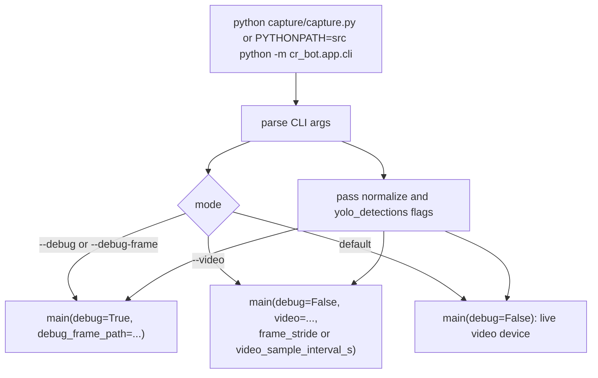

## `src/cr_bot/app/main.py`: Top-Level Runtime

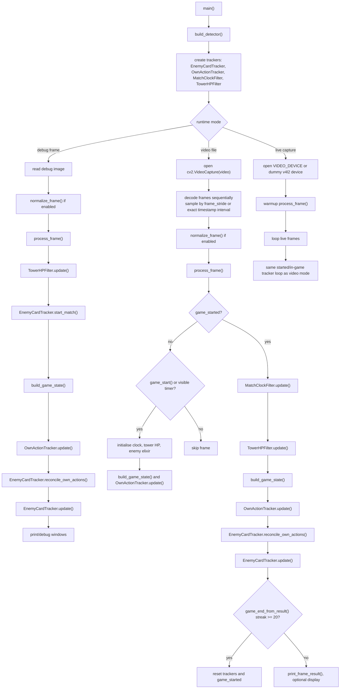

## `src/cr_bot/app/pipeline.py`: `process_frame()`

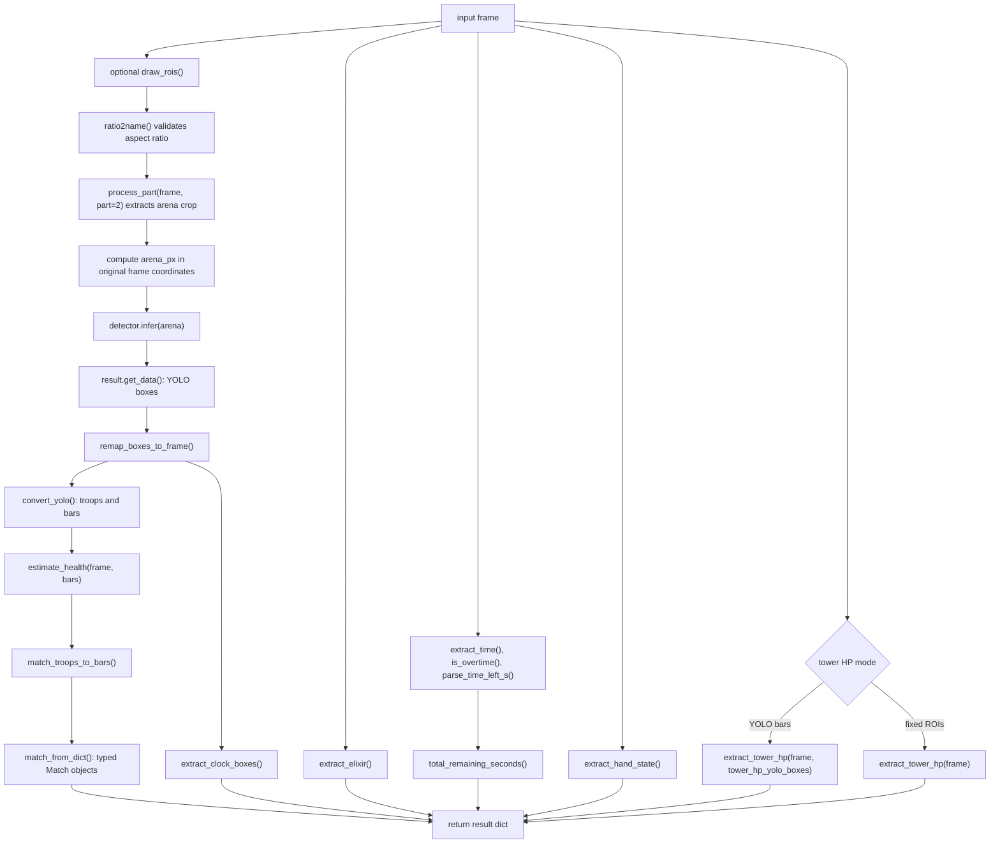

## Runtime State Assembly

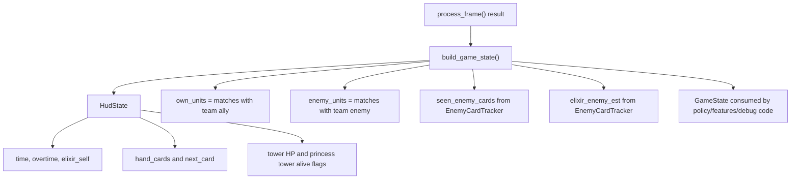

## Own Action Tracking

`OwnActionTracker` detects the player's actions incrementally. A hand-slot change
creates a `PendingOwnPlay`; later frames attach timing evidence and a placement
cell. The action is emitted only when the evidence required by that card type is
available. Mirror is represented as the repeated card with
`played_via="mirror"`; it is not emitted as a separate `mirror` action.

```mermaid
flowchart TD
    subgraph Inputs["Per-frame inputs"]
        I1["game_state<br/>hud.hand_cards: list[str | None]<br/>hud.elixir_self: float<br/>total_remaining_s: float<br/>own_units: list[Match]"]
        I2["arena_px<br/>(x, y, width, height)"]
        I3["frame<br/>BGR image or None"]
        I4["clock_boxes<br/>list[{team, confidence,<br/>center_x, center_y, ...}]"]
        I5["elixir_change<br/>{covered, white, pink, edges}<br/>from digit-overlay detector"]
        I6["video_time_s<br/>float or None"]
        I7["own_actions_blocked<br/>bool, true during emote clutter"]
    end

    I1 --> U["OwnActionTracker.update(...)"]
    I2 --> U
    I3 --> U
    I4 --> U
    I5 --> U
    I6 --> U
    I7 --> U

    U --> B{"own_actions_blocked?"}
    B -->|"yes"| B1["Preserve pending plays<br/>Update last_hand, last_elixir,<br/>recent hand and slot history<br/>Return None"]
    B -->|"no"| D["_detect_slot_drops(hand, elixir, now,<br/>optional visual-overlay timestamp)"]

    D --> D1{"How did a hand slot change?"}
    D1 -->|"previous card -> None"| P0["_resolve_drop_card()<br/>stabilize label from slot history"]
    D1 -->|"Log or Barbarian Barrel -> another label"| P0
    D1 -->|"other replacement"| D2["Ignore as OCR churn"]
    D1 -->|"no relevant change"| C1["Continue"]
    P0 --> PM{"Dropped card is Mirror?"}
    PM -->|"yes, prior confirmed action exists"| PM1["Use previous action.card<br/>played_via = mirror"]
    PM -->|"yes, no prior action"| PM2["Ignore unresolved Mirror drop"]
    PM -->|"no"| P1["Use dropped card<br/>played_via = None"]
    PM1 --> P2
    P1 --> P2
    P2["Append PendingOwnPlay carrying<br/>card, slot_idx, started_at_s, elixir_before,<br/>played_via, visual/numeric elixir timestamps,<br/>spell state and rolling-spell state"] --> C1
    PM2 --> C1
    D2 --> C1

    C1 --> V{"elixir_change.covered?"}
    V -->|"yes"| V1["_attach_elixir_change_to_pending(now, video_time_s)<br/>Return None<br/>Attach calibrated visual-overlay timestamp<br/>to closest eligible pending play"]
    V -->|"no"| C2["Continue"]
    V1 --> C2

    C2 --> CP["_confirm_pending(...)"]
    CP --> T1["Remember tracked own units<br/>Input: game_state.own_units<br/>Update recent_ally_tracks<br/>Output: new_tracks"]
    T1 -.-> F1["_record_new_track_actions(new_tracks, hand, arena_px, now, clock_boxes)<br/>Only when no pending play existed<br/>DIRECT_UNIT_TO_CARD maps track class to card<br/>Allow only explicit track-fallback cards"]
    F1 --> F2["_infer_cell_from_clock([match], arena_px, clock_boxes, card)<br/>Return deploy-clock cell or allowed troop-center fallback"]
    F2 --> A
    T1 --> E1["_pending_for_current_elixir_drop(elixir, now, preferred_pending)<br/>Compare current drop with required card cost<br/>Mirror uses repeated-card cost + 1<br/>Output: one PendingOwnPlay or None"]
    E1 --> E2{"Numeric elixir drop selected<br/>a pending play?"}
    E2 -->|"yes"| E3["Latch numeric_elixir_drop_time_s<br/>and numeric_elixir_drop_video_time_s<br/>on PendingOwnPlay"]
    E2 -->|"no"| K{"Pending card type?"}
    E3 --> K

    K -->|"normal troop or building"| N1["_recent_tracks_for_pending(pending, now)<br/>Return recent list[Match]"]
    N1 --> N2["_infer_cell_from_clock(tracks, arena_px, clock_boxes, card)<br/>Match card track to nearby ally deploy clock<br/>Return cell: tuple[int, int] or None"]
    N2 --> N3{"Cell and visual or latched<br/>numeric elixir evidence?"}

    K -->|"other spell"| S1["_confirm_pending_spell(pending, arena_px, frame, elixir_confirms)<br/>SpellDeployLocator uses radius metadata to find<br/>white aim ellipse and purple release marker<br/>Return (cell or None, keep_pending)"]
    S1 --> S2{"Release cell and latched<br/>spell elixir evidence?"}

    K -->|"Log or Barbarian Barrel"| R1["_confirm_pending_rolling_spell(...)<br/>Use first visible ally rolling-object center<br/>and latch spell elixir evidence<br/>Return (cell or None, keep_pending)"]
    R1 --> R2{"First rolling cell and latched<br/>spell elixir evidence?"}

    N3 -->|"yes"| A
    S2 -->|"yes"| A
    R2 -->|"yes"| A
    N3 -->|"not yet, within timeout"| W["Keep PendingOwnPlay for a later frame"]
    S2 -->|"not yet, keep_pending"| W
    R2 -->|"not yet, keep_pending"| W
    N3 -->|"stale"| X["Remove pending play without emitting action"]
    S2 -->|"cancelled"| X
    R2 -->|"stale or mismatched"| X

    A["_append_action(now, card, slot_idx, cell,<br/>video_time_s, rolling_spell_track_id, played_via)<br/>Reject pre-start actions<br/>Reject recent duplicates except confirmed Mirror"] --> A1["Append OwnActionEvent<br/>{time_left_s, video_time_s, card, slot_idx, cell,<br/>rolling_spell_track_id, played_via}"]
    A1 --> OUT["OwnActionTracker.actions<br/>list[OwnActionEvent] consumed by enemy-card<br/>reconciliation, debug output and state pipelines"]
    W --> OUT2["Update tracker memory and return None"]
    X --> OUT2
```

### Own Action Data Contracts

| Value | Producer | Shape | Purpose |
| --- | --- | --- | --- |
| `game_state.hud.hand_cards` | `build_game_state()` | Four-element `list[str \| None]` | Detect the card that disappeared from a hand slot. |
| `game_state.hud.elixir_self` | `build_game_state()` from `extract_elixir()` | `float` | Compare adjacent frames and latch numeric elixir-drop evidence. |
| `elixir_change` | `detect_elixir_change()` | `{covered: bool, white: float, pink: float, edges: float}` | Detect the visual digit overlay and preserve its timestamp. |
| `game_state.own_units` | YOLO conversion and `build_game_state()` | `list[Match]`, each with `match.troop.class_name`, `track_id`, center and team | Associate a pending play with a visible own unit or rolling spell. |
| `clock_boxes` | `extract_clock_boxes()` | `list[dict]` with track ID, team, confidence, box and center coordinates | Estimate the placement cell for normal troops and buildings. |
| `PendingOwnPlay` | `_detect_slot_drops()` | Stateful dataclass including card, slot, evidence timestamps, spell state, rolling-spell state and `played_via` | Join asynchronous hand, elixir, clock and spell evidence. |
| `OwnActionTracker.actions` | `_append_action()` | `list[OwnActionEvent]` with `time_left_s`, `video_time_s`, `card`, `slot_idx`, `cell`, `rolling_spell_track_id`, `played_via` | Final confirmed own-action stream. Mirror retains the repeated card ID. |

### Rolling-Spell Own Action Detection

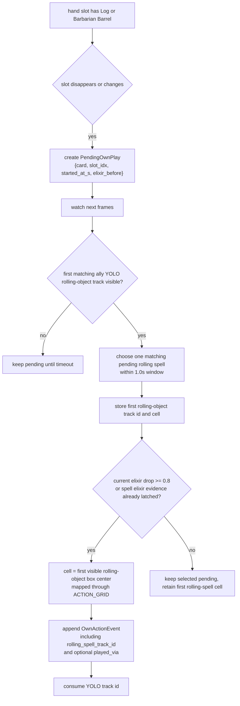

## Enemy Card Tracking

`EnemyCardTracker` combines deploy-clock claims, multi-frame detector evidence,
motion direction, own-action reconciliation and spell-specific continuation
tracking. Recorded plays may be revised later when class votes or projectile
evidence improve.

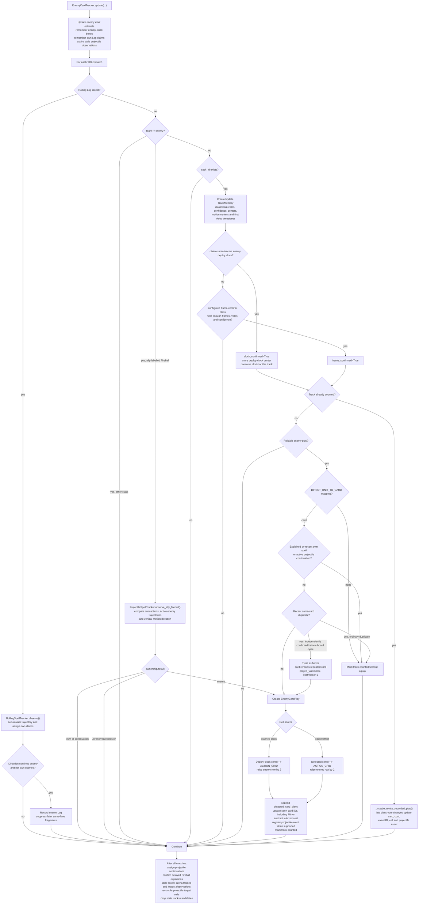

Enemy troops and buildings normally need a deploy-clock box that can be claimed
by their specific YOLO track. A nearby `clock:enemy` summary alone is not enough:
the clock must pass confidence/team filters, be geometrically near the troop, and
not already be consumed by another track. Frame-only confirmation is limited to
spell-like detector classes and configured exceptions such as Electro Wizard.

Some detector classes intentionally do not map directly to playable cards. If a
confirmed detector class still maps to `DIRECT_UNIT_TO_CARD == None`, the tracker
marks the track counted and does not append an enemy play. Skeleton and Skeleton
Evolution detections are exceptions: once confirmed, they map to the `skeletons`
card.

Enemy spells are generally frame-confirmed without a deploy clock. Fireball
ownership is resolved from vertical motion and recent own Fireball actions;
later detections can be attached to an existing enemy projectile event and move
its cell farther along the trajectory. The tracker also retains recent arena
frames and spell-target observations for projectile reconciliation. Log uses
trajectory direction plus explicit own-action claims to avoid counting the
player's rolling spell as an enemy action.

Before each enemy update, `MatchSession` calls
`EnemyCardTracker.reconcile_own_actions()`. It removes previously recorded enemy
Log, Fireball or other spell events that are later explained by confirmed own
actions, releases their projectile records and refunds the enemy elixir
estimate.

Mirror cannot be seen directly in the enemy hand. The tracker infers it only
when the same card appears again before four intervening enemy plays and the
second play has independent evidence, such as a claimed deploy clock or a
distinct spell target. The event keeps the repeated card ID, sets
`played_via="mirror"`, charges one extra elixir and adds Mirror to the seen-card
set. A repeat after four intervening plays is treated as a normal cycle.

The current enemy cell calibration raises every emitted enemy play cell by two
rows after grid conversion. In practical terms, `(7, 7)` becomes `(7, 5)`,
clamped at row `0`.

## Enemy Log Detection

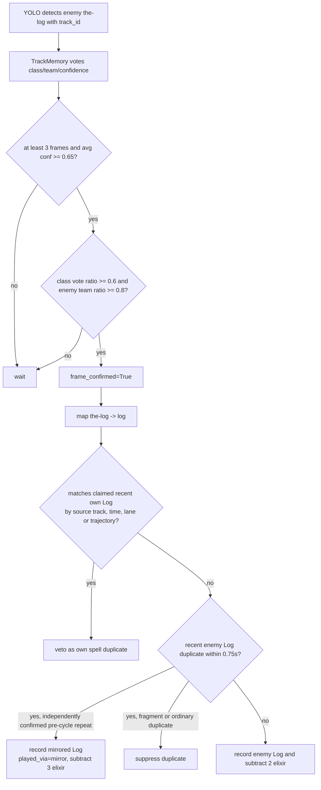

## Vision And YOLO Runtime

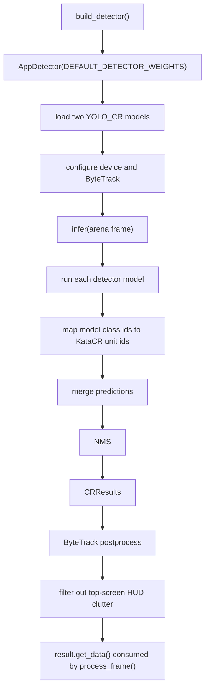

## Extractors

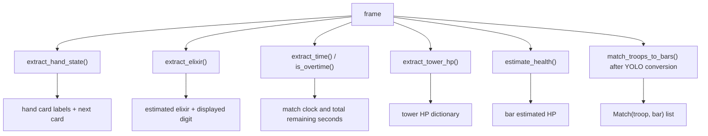

## Feature Pipeline

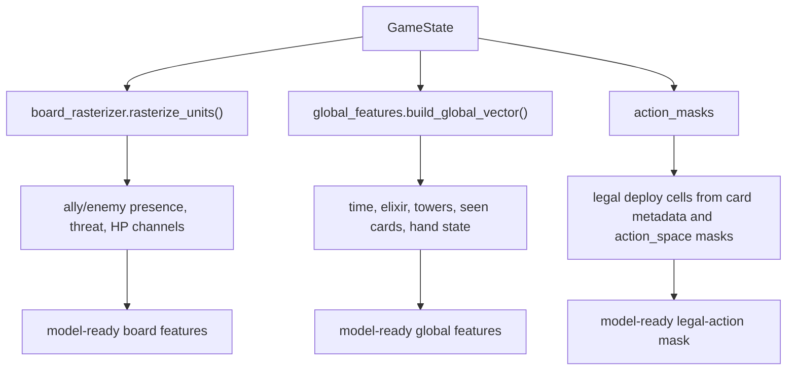

## Card Classifier Dataset Scripts

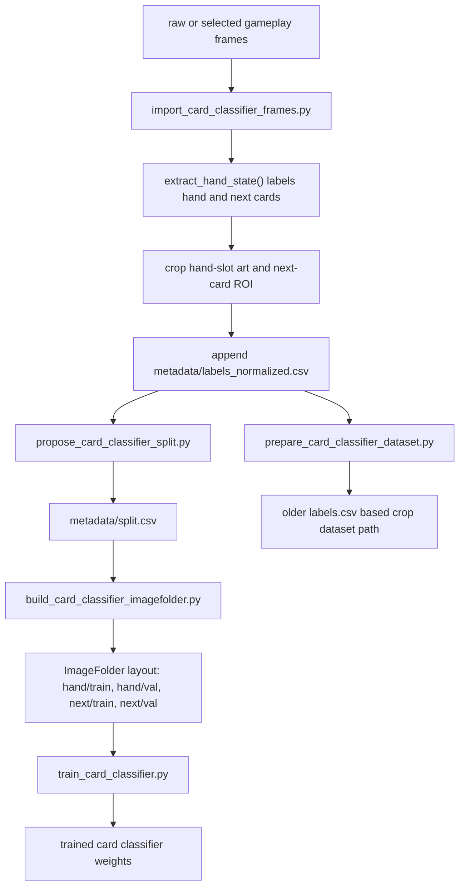

## Seed Detector Dataset And Training Scripts

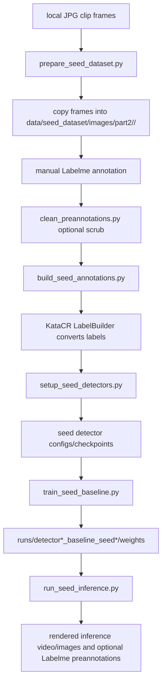

## Enemy Audio Mining Scripts

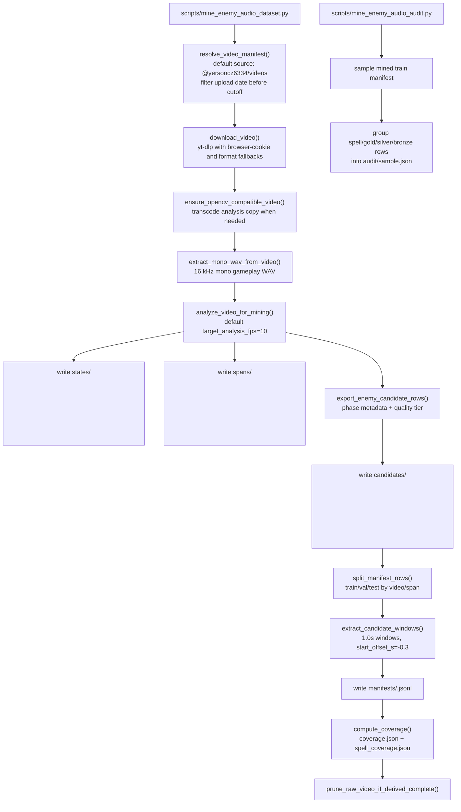

## Audio Classifier Training And Evaluation

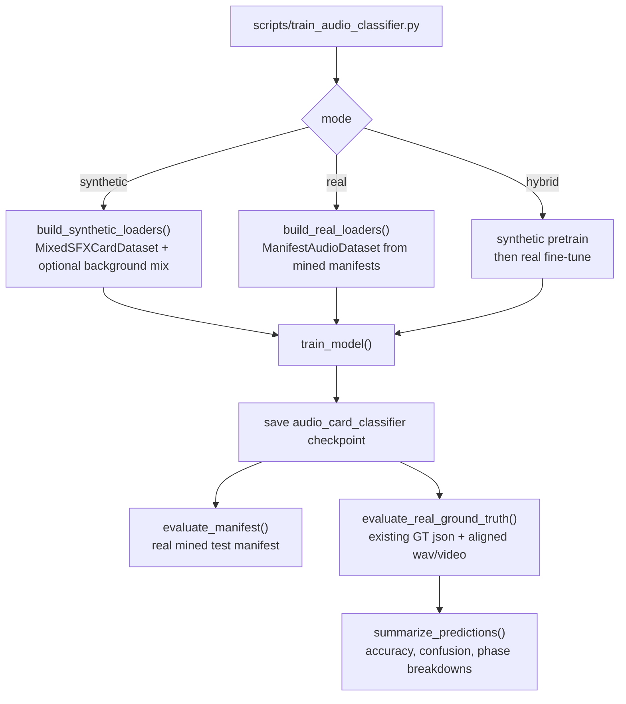

## Data Generation Scripts

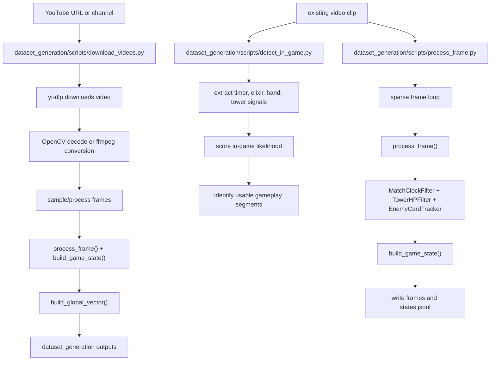

## Utility Scripts

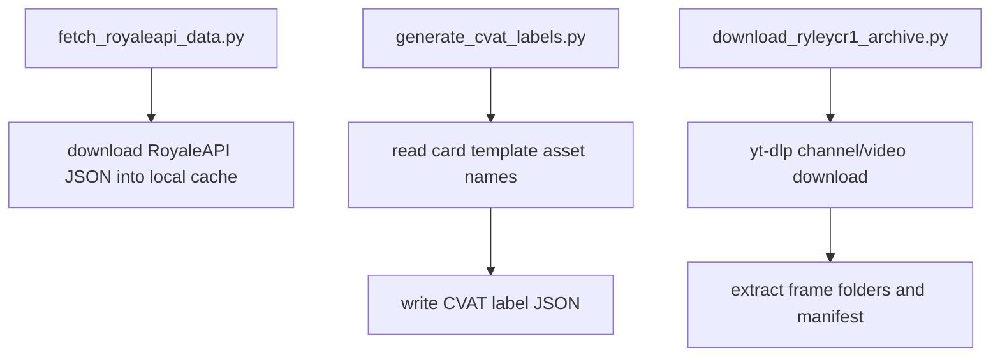

## Debug Scripts

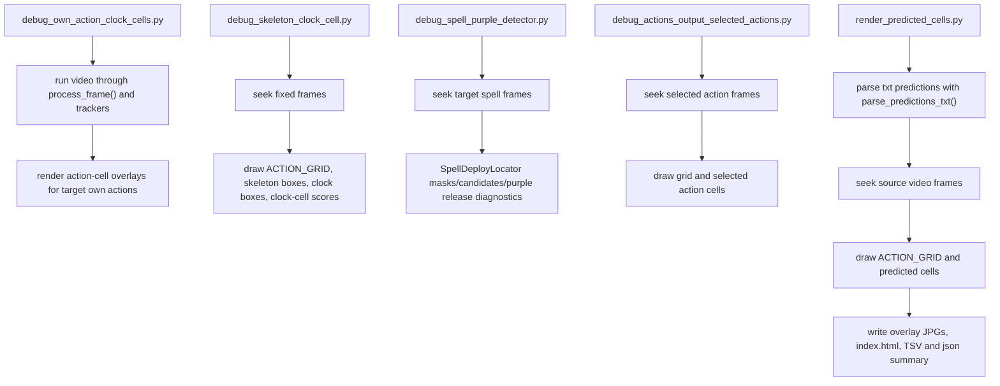

## Cross-Cutting Data Objects

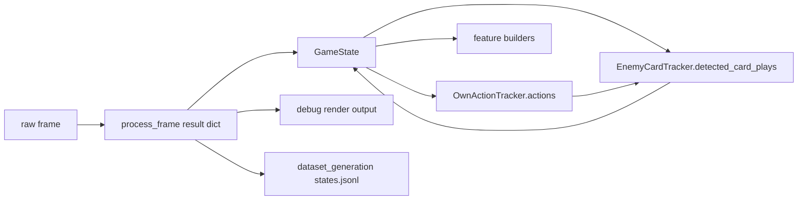
