# Flowcharts

This document maps the first-party runtime, extraction, tracking, dataset, and debug scripts. Diagrams use Mermaid so they render directly in GitHub Markdown.

Generated CVAT serverless functions, vendored code, and virtualenv files are intentionally excluded.

## Script Index

| Script | Diagram section |
| --- | --- |
| `capture/capture.py` | `capture/cli.py` and `capture/capture.py` |
| `capture/cli.py` | `capture/cli.py` and `capture/capture.py` |
| `capture/main.py` | `capture/main.py`: Top-Level Runtime, `capture/main.py`: `process_frame()` |
| `capture/scripts/build_card_classifier_imagefolder.py` | Card Classifier Dataset Scripts |
| `capture/scripts/build_seed_annotations.py` | Seed Detector Dataset And Training Scripts |
| `capture/scripts/clean_preannotations.py` | Seed Detector Dataset And Training Scripts |
| `capture/scripts/download_ryleycr1_archive.py` | Utility Scripts |
| `capture/scripts/fetch_royaleapi_data.py` | Utility Scripts |
| `capture/scripts/generate_cvat_labels.py` | Utility Scripts |
| `capture/scripts/import_card_classifier_frames.py` | Card Classifier Dataset Scripts |
| `capture/scripts/prepare_card_classifier_dataset.py` | Card Classifier Dataset Scripts |
| `capture/scripts/prepare_seed_dataset.py` | Seed Detector Dataset And Training Scripts |
| `capture/scripts/propose_card_classifier_split.py` | Card Classifier Dataset Scripts |
| `capture/scripts/run_seed_inference.py` | Seed Detector Dataset And Training Scripts |
| `capture/scripts/setup_seed_detectors.py` | Seed Detector Dataset And Training Scripts |
| `capture/scripts/train_card_classifier.py` | Card Classifier Dataset Scripts |
| `capture/scripts/train_seed_baseline.py` | Seed Detector Dataset And Training Scripts |
| `capture/scripts/debug/debug_actions_output_selected_actions.py` | Debug Scripts |
| `capture/scripts/debug/debug_own_action_clock_cells.py` | Debug Scripts |
| `capture/scripts/debug/debug_skeleton_clock_cell.py` | Debug Scripts |
| `capture/scripts/debug/debug_spell_purple_detector.py` | Debug Scripts |
| `dataset_generation/scripts/detect_in_game.py` | Data Generation Scripts |
| `dataset_generation/scripts/download_videos.py` | Data Generation Scripts |
| `dataset_generation/scripts/process_frame.py` | Data Generation Scripts |

## `capture/cli.py` And `capture/capture.py`

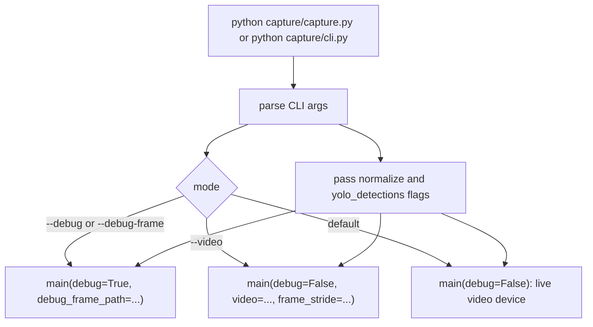

## `capture/main.py`: Top-Level Runtime

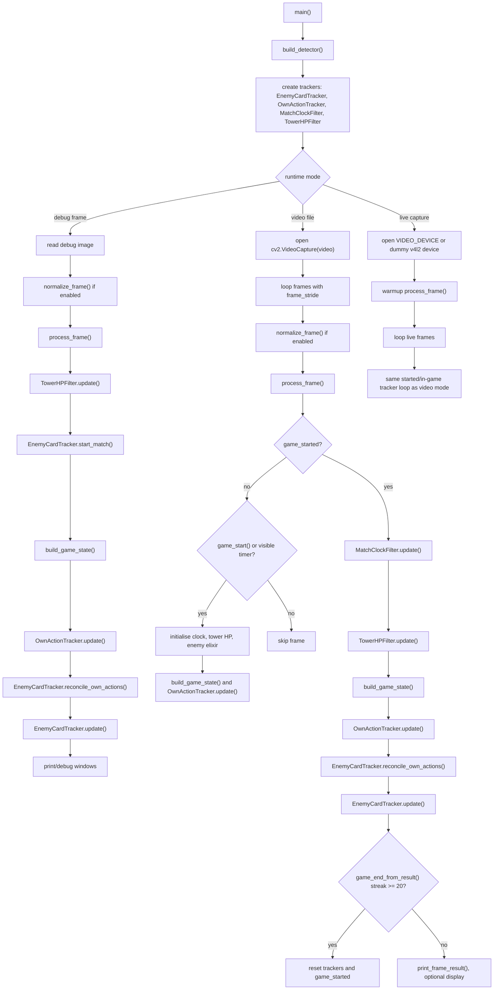

## `capture/main.py`: `process_frame()`

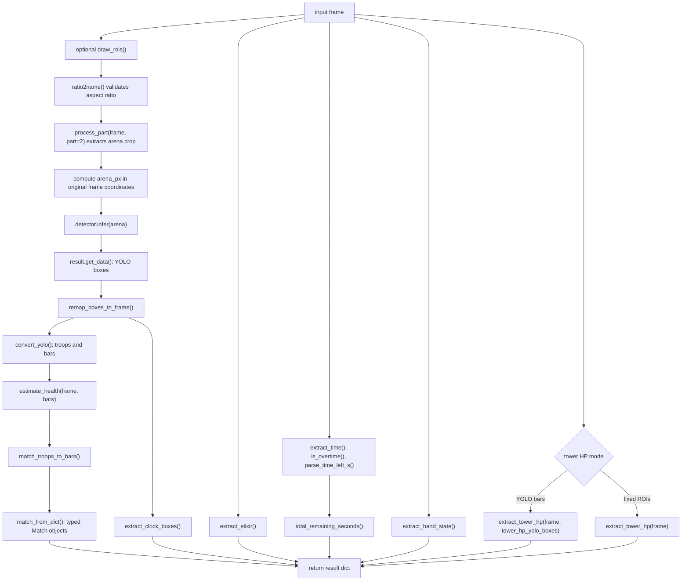

## Runtime State Assembly

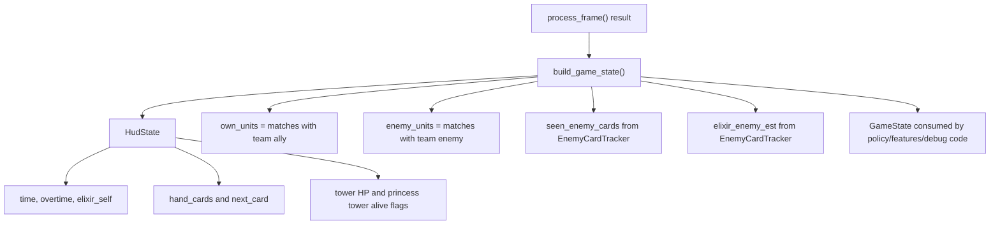

## Own Action Tracking

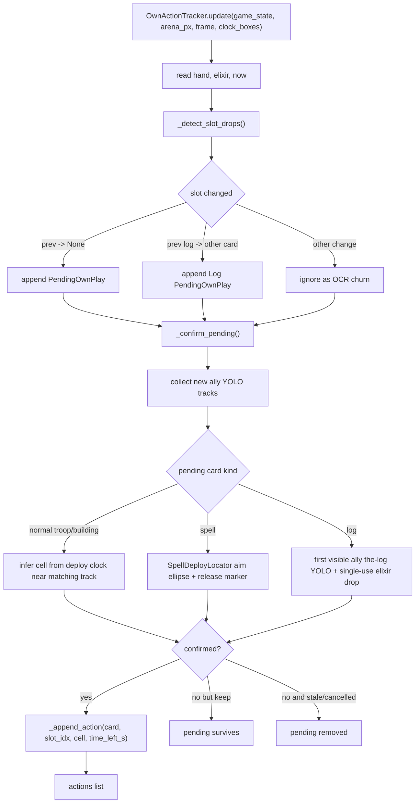

## Log-Specific Own Action Detection

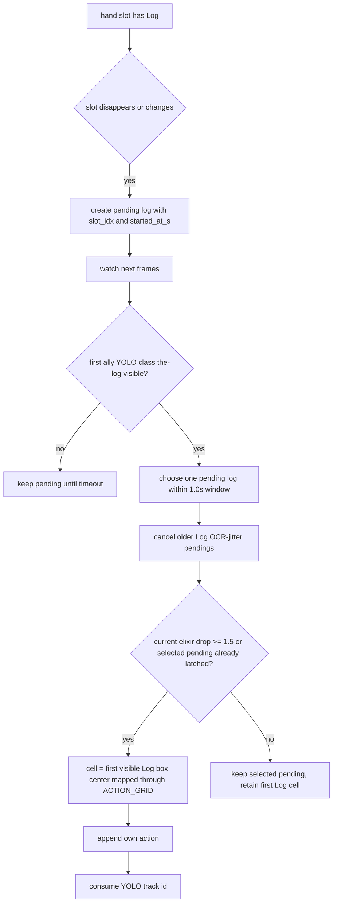

## Enemy Card Tracking

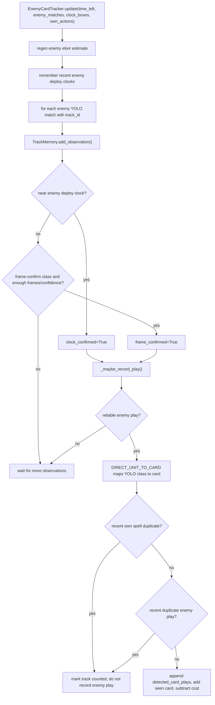

## Enemy Log Detection

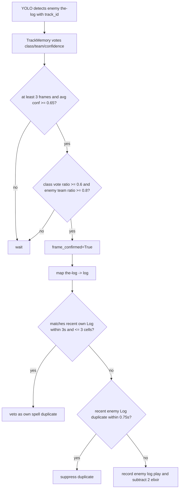

## Vision And YOLO Runtime

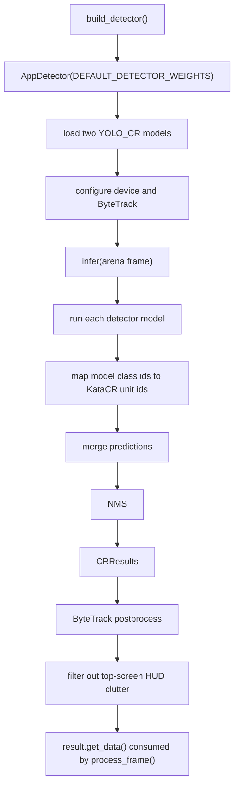

## Extractors

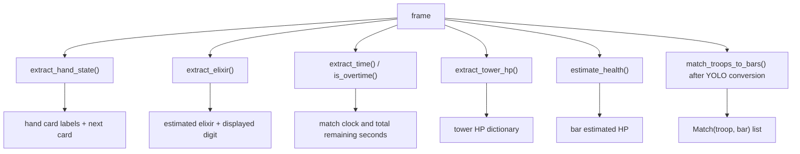

## Feature Pipeline

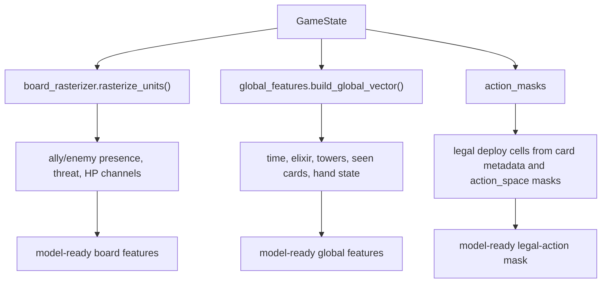

## Card Classifier Dataset Scripts

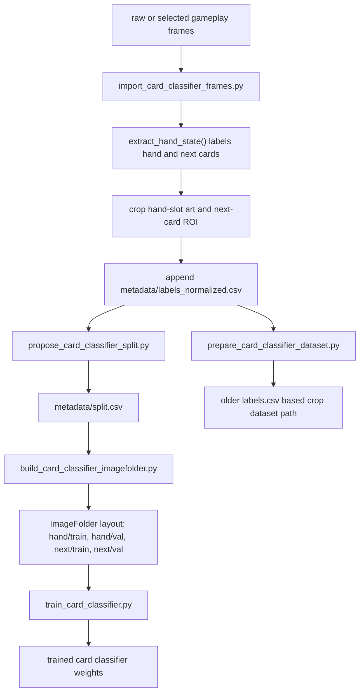

## Seed Detector Dataset And Training Scripts

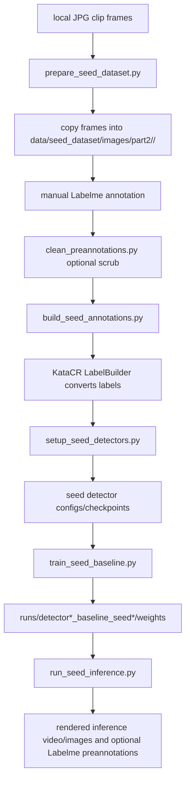

## Data Generation Scripts

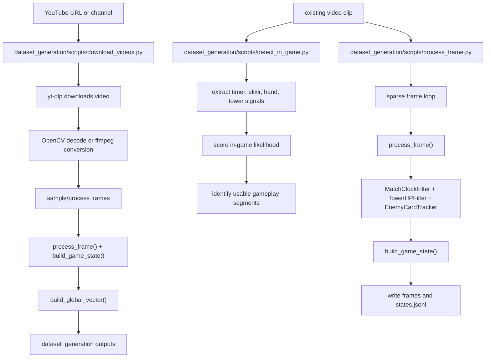

## Utility Scripts

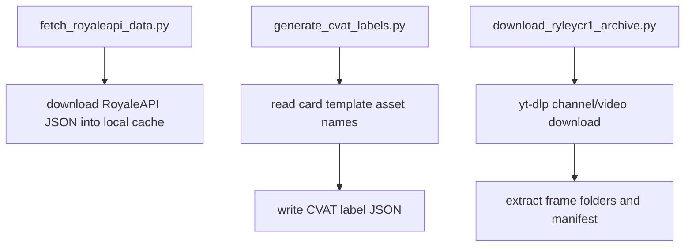

## Debug Scripts

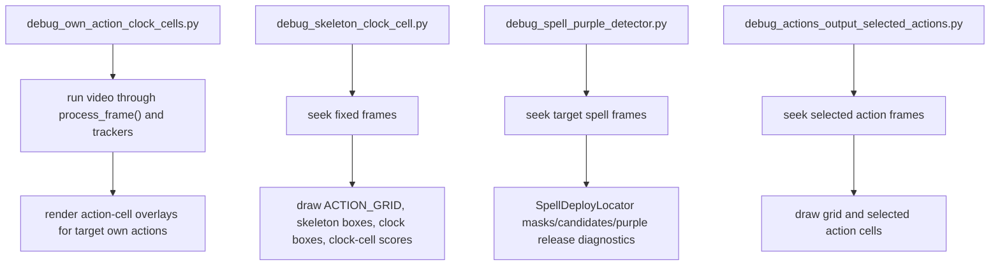

## Cross-Cutting Data Objects

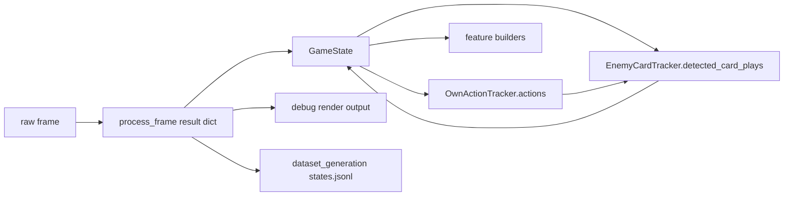
